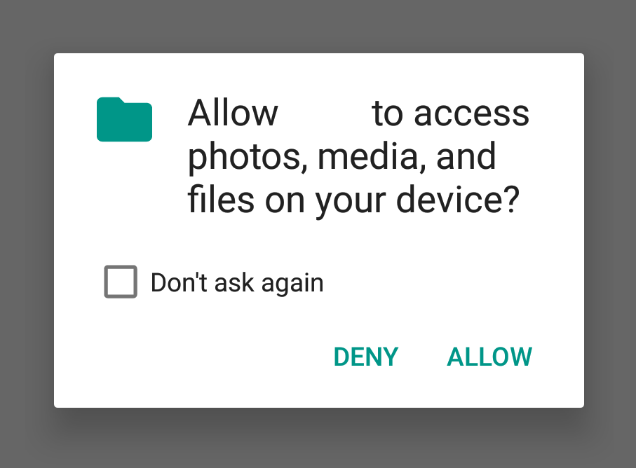

### 系统的权限对话框应该怎么选？（运行时权限）

对于目标 SDK 为 23 （Android 6.0) 及以上的应用，系统将不再授予危险权限，应用需要请求用户授予权限。

> 危险权限是指涉及用户数据的权限，如通信录、位置、存储空间等权限。其他普通权限仍会被默认授予。

因此在使用时那些应用时，会看到如下图的权限请求对话框，这是“运行时权限”。

但该特性本意是给用户更大的选择权与知情权。但不幸的是，该特性会被部分应用滥用，如不授予非必要权限就拒绝运行。

**AppOps 的设置与运行时权限独立，且判断后于运行时权限**，即在运行时权限选择“允许”，AppOps 中选择“禁用”，**最终结果会是禁用**。

> 注意：应用仍可能通过调用相关系统 API 来获知是否被禁用，只是绝大多数应用没有这么做。